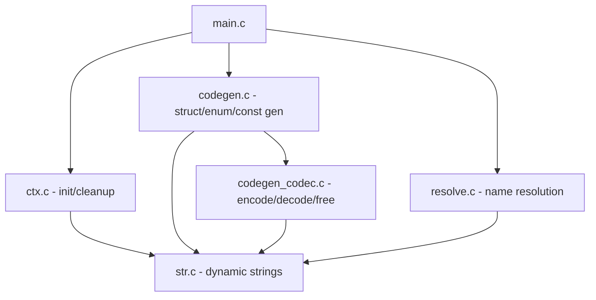

# Refactor `compiler/capnpc-c.c` into Modular Architecture

## Problem Statement
The Cap'n Proto C compiler plugin (`capnpc-c.c`) is a single 2850-line monolithic file mixing parsing, name resolution, and code generation. This makes it hard to understand, maintain, or extend with new features. The refactor splits it into phase-based modules while ensuring identical output.

## Requirements
- Split into separate files by phase: parse, resolve, codegen, main
- Replace unsafe `char buf[256]` + `sprintf`/`strcpy` with the existing `str` dynamic string library
- Reduce code duplication (especially the triplicated list encoder/decoder/free patterns)
- Verify correctness via golden file comparison AND test suite (including examples/book)
- Each task must leave the compiler buildable and producing identical output

## Background
- Build systems: meson.build and CMakeLists.txt both compile `capnpc-c.c`, `schema.capnp.c`, `str.c` into the `capnpc-c` executable
- Tests: GTest-based suite in `tests/` (capn-test, capn-stream-test, example-test) + `compiler/schema-test.cpp` + `examples/book`
- Golden files: `test.capnp.h`, `test.capnp.c`, `addressbook.capnp.h`, `addressbook.capnp.c` are checked in
- The compiler reads a Cap'n Proto CodeGeneratorRequest from stdin/file and writes `.h`/`.c` files

## Proposed Solution
Split into these modules:
```
compiler/
├── capnpc-c.c          → main.c (entry point, CLI handling)
├── ctx.h / ctx.c       → context struct, init, cleanup
├── resolve.h / resolve.c → name resolution pass
├── codegen.h / codegen.c → header/source generation (structs, enums, consts)
├── codegen_codec.h / codegen_codec.c → encode/decode/free generation
├── str.h / str.c       → (unchanged, existing dynamic string library)
└── schema.capnp.c/.h   → (unchanged, generated)
```



## Task Breakdown

### Task 1: Set up golden file test infrastructure
- **Objective:** Create a test script that builds the compiler, runs it against `test.capnp`, `addressbook.capnp`, and `book.capnp`, and diffs output against checked-in golden files.
- **Implementation:** Write a shell script or CTest custom command that invokes `capnpc-c` on each schema and compares output byte-for-byte.
- **Test requirements:** The script must pass with the current unmodified compiler (baseline).
- **Demo:** Running the script produces "all golden files match" with exit 0.

### Task 2: Extract shared types and context into `ctx.h` / `ctx.c`
- **Objective:** Move `capnp_ctx_t`, `struct node`, `struct field`, `struct value`, `struct id_bst`, `struct string_list`, and their associated functions (`find_node`, `insert_node`, `insert_id`, `contains_id`, `free_id_bst`, `insert_file`, `free_string_list`, `fail()`) into a separate module.
- **Implementation:** Create `compiler/ctx.h` with type definitions and function declarations. Create `compiler/ctx.c` with implementations. Update `capnpc-c.c` to `#include "ctx.h"` and remove the moved code. Update meson.build and CMakeLists.txt to compile `ctx.c`.
- **Test requirements:** Golden file test passes. Build succeeds on both build systems.
- **Demo:** `capnpc-c` builds from multiple source files and produces identical output.

### Task 3: Extract name resolution into `resolve.h` / `resolve.c`
- **Objective:** Move `resolve_names`, `ctx_resolve_names`, `ctx_mark_used_import`, and `get_text_annotation`/`get_mapname`/`get_maplistcount`/`get_mapuniontag` into a separate module.
- **Implementation:** Create `compiler/resolve.h` and `compiler/resolve.c`. The annotation helpers are used by codegen too, so they go in `ctx.h`/`ctx.c` (or a shared `annotations.h`). Update build files.
- **Test requirements:** Golden file test passes.
- **Demo:** Name resolution logic is isolated; `capnpc-c` still produces identical output.

### Task 4: Replace `char buf[256]` patterns with `str` library
- **Objective:** Eliminate all 34 `sprintf`/`strcpy`/`strcat` into fixed-size buffers. Use `struct str` + `strf()` instead.
- **Implementation:** In each function that uses `char buf[256]`, replace with a `struct str` (either local with `str_release` or passed-in). Key locations: `mk_struct_list_encoder`, `mk_struct_ptr_encoder`, `mk_struct_list_decoder`, `mk_struct_ptr_decoder`, `mk_struct_list_free`, `mk_struct_ptr_free`, `encode_member`, `decode_member`, `free_member`, `define_field`, `do_union`.
- **Test requirements:** Golden file test passes. No buffer overflow possible regardless of input name length.
- **Demo:** `grep -r 'char buf\[256\]' compiler/` returns no results; output is identical.

### Task 5: Extract code generation into `codegen.h` / `codegen.c`
- **Objective:** Move `define_enum`, `define_const`, `define_struct`, `define_group`, `define_field`, `do_union`, `union_cases`, `union_block`, `declare_slot`, `field_name`, `set_member`, `get_member`, `xor_member`, `ptr_member`, `decode_value`, `decode_field`, `declare`, `declare_ext`, `define_getter_functions`, `define_setter_functions` into `codegen.c`.
- **Implementation:** Create `compiler/codegen.h` with public interface (functions called from main). Move `struct strings` definition here. Update build files.
- **Test requirements:** Golden file test passes.
- **Demo:** Core code generation is in its own module; main file is now just orchestration.

### Task 6: Extract codec generation into `codegen_codec.h` / `codegen_codec.c`
- **Objective:** Move `encode_member`, `decode_member`, `free_member`, `mk_simple_list_encoder`, `mk_simple_list_decoder`, `mk_simple_list_free`, `gen_call_list_encoder`, `gen_call_list_decoder`, `gen_call_list_free`, `mk_struct_list_encoder`, `mk_struct_ptr_encoder`, `mk_struct_list_decoder`, `mk_struct_ptr_decoder`, `mk_struct_list_free`, `mk_struct_ptr_free`, `declare_codec`, `mk_codec_declares` into a dedicated module.
- **Implementation:** Create `compiler/codegen_codec.h` and `compiler/codegen_codec.c`. These functions are called from `codegen.c` (for `define_struct`) and from `ctx_gen` (for the list/ptr helpers). Update build files.
- **Test requirements:** Golden file test passes.
- **Demo:** Codec generation is fully isolated; adding a new codec pattern only touches `codegen_codec.c`.

### Task 7: Reduce duplication in list encoder/decoder/free generation
- **Objective:** The three `gen_call_list_*` functions and three `mk_simple_list_*` functions share identical switch structures. Refactor to use a table-driven approach or a shared helper that takes a function pointer / enum for the operation type.
- **Implementation:** Create a `struct list_type_info` table mapping `Type_*` enum values to their C type name, list type, getter/setter names. Replace the switch statements with table lookups. Introduce an `enum codec_op { CODEC_ENCODE, CODEC_DECODE, CODEC_FREE }` to parameterize the shared logic.
- **Test requirements:** Golden file test passes. Code line count in `codegen_codec.c` reduced significantly.
- **Demo:** Adding support for a new list element type requires adding one table entry instead of modifying three switch statements.

### Task 8: Slim down `main.c` and clean up `ctx_gen`
- **Objective:** The `ctx_gen` function (~200 lines) mixes file I/O, annotation processing, and orchestration of code generation. Split it so `main.c` handles only CLI parsing and file I/O, while generation logic calls into codegen modules.
- **Implementation:** Extract annotation processing from `ctx_gen` into a helper. Move file writing into `main.c`. The generation loop calls `codegen_file(ctx, file_node)` which returns the HDR/SRC strings.
- **Test requirements:** Golden file test passes. Full test suite passes (meson test / ctest).
- **Demo:** `main.c` is under 50 lines. The compiler's pipeline is clearly: init → resolve → mark_imports → generate → write.

### Task 9: Eliminate static buffer anti-pattern
- **Objective:** Replace `static struct str buf` return-value buffers in `xor_member`, `ptr_member`, `field_name` with caller-owned buffers or context-owned scratch space.
- **Implementation:** Add a `struct str scratch` field to `capnp_ctx_t` (or pass a scratch buffer parameter). Each function that previously returned a pointer to a static buffer now writes into the scratch buffer and returns `scratch->str`. Document the lifetime constraint.
- **Test requirements:** Golden file test passes. Functions are now reentrant.
- **Demo:** `grep -c 'static struct str' compiler/*.c` returns 0 (excluding `str_static` in str.c).

### Task 10: Final validation — full test suite + examples
- **Objective:** Run the complete verification: golden file diffs, GTest suite, and examples/book build+run.
- **Implementation:** Run `meson test` (or `ctest`) with all tests enabled. Build and run `examples/book`. Verify no warnings with `-Wall -Wextra`. Optionally run with AddressSanitizer to confirm no memory errors in the compiler itself.
- **Test requirements:** All tests pass. No new warnings. ASan clean.
- **Demo:** CI-equivalent test run passes; the refactored compiler is a drop-in replacement.
